<picture>
  <source media="(max-width: 640px)" srcset="./assets/hero-mobile.svg" />
  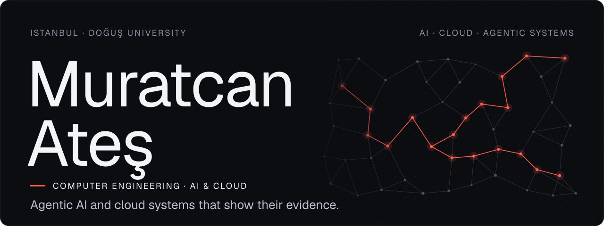
</picture>

# Muratcan Ateş

Final-year Computer Engineering student at Doğuş University in Istanbul, focused on AI and cloud engineering. I build Python APIs, retrieval-augmented assistants and MCP tools, usually together with AI coding agents working inside specs, tests and CI checks that I set up. I like systems that can show their work: answers that cite a source, decisions that leave an audit trail, and tests that are proven to fail when the code breaks.

[LinkedIn](https://linkedin.com/in/muratcanates) / [Medium](https://medium.com/@muratcanates) / [g.dev](https://g.dev/muratcanates) / [All repositories](https://github.com/muratcan-ates?tab=repositories)

## GitHub, in numbers

<picture>
  <source media="(max-width: 640px)" srcset="./assets/metrics-mobile.svg" />
  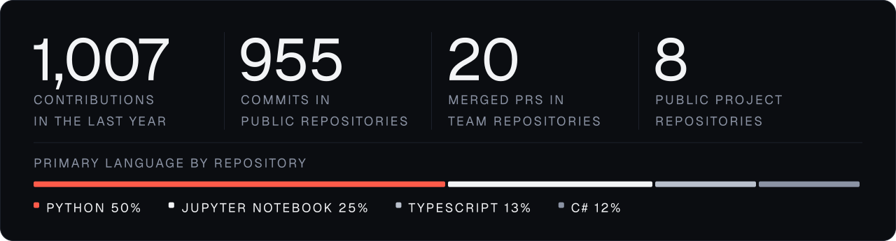
</picture>

Refreshed every Monday from the public GitHub API by a workflow in this repository. Pull requests are counted in my team repositories. Forks, archived and empty repositories and this profile repository are left out.

## Featured

### [CloudSentinel](https://github.com/muratcan-ates/cloudsentinel)

<a href="https://github.com/muratcan-ates/cloudsentinel">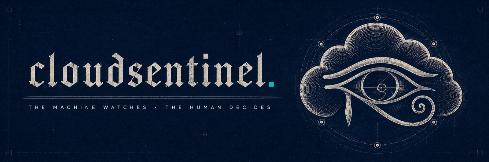</a>

**YZTA Bootcamp 2026, AI track, Group 60** · Scrum Master in a team of four · June to August 2026

CloudSentinel is decision support for cloud cost and security anomalies. A deterministic statistical detector flags a signal. An analyst agent explains it with cited evidence rows, and a recommender drafts a cautious and a bold option whose savings are computed in Python. A skeptic, or a three-seat review panel, challenges contested drafts. Nothing moves until a human approves or rejects (execution is simulated), and each verdict is sealed into a SHA-256 hash chain that `GET /audit/verify` recomputes from the first entry.

I own the repository. My commits added the LLM provider layer, the analyst and recommender agents, the approval lifecycle, the ledger and the Render deployment. My teammates added the cost-summary, health and market-watch endpoints and the first CI workflow in eight pull requests, which I merged. At the final commit, CI passes 1,321 tests and the API exposes 59 documented paths.

[Live demo (read-only, simulated data, deterministic stand-in for the model)](https://cloudsentinel-y5zh.onrender.com) / [API docs](https://cloudsentinel-y5zh.onrender.com/docs) / [Architecture](https://github.com/muratcan-ates/cloudsentinel/blob/main/docs/architecture.md) / [Eval scorecard](https://github.com/muratcan-ates/cloudsentinel/blob/main/docs/EVAL_SCORECARD.md) / [Limitations](https://github.com/muratcan-ates/cloudsentinel/blob/main/docs/LIMITATIONS.md)

Screen: the operator dashboard (simulated data)

 
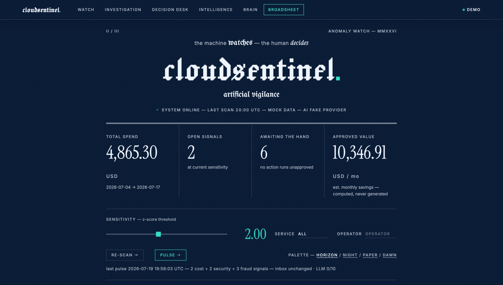

### [DOU-Synapse](https://github.com/muratcan-ates/DOU-Synapse)

<a href="https://github.com/muratcan-ates/DOU-Synapse">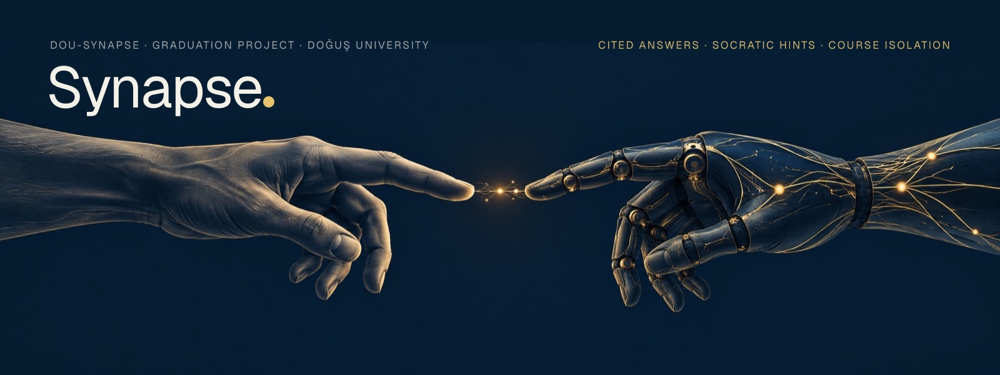</a>

**Graduation project, Doğuş University** · Project lead in a team of three · August to September 2026

DOU-Synapse is a course and exam assistant built to answer only from material the instructor uploads, showing the file and page behind each answer. When no passage clears the evidence threshold, it refuses without calling the language model; that threshold is still being tuned. In Socratic mode it holds back the answer and gives graded hints, moving to a sourced explanation only after the student has made real attempts.

I led the team and built the system myself across the Next.js frontend and the FastAPI backend (530 of the 545 commits on main), writing much of the code with AI coding agents that work under written agent instructions and a change-dossier check in CI.

Course isolation is enforced twice: first by an API membership check, then by PostgreSQL row-level security. On every CI run the pipeline deliberately breaks one RLS policy and requires the isolation tests to fail. Retrieval combines pgvector HNSW search with PostgreSQL full-text search through reciprocal rank fusion. In the latest CI run on main, 2,197 backend tests and 684 frontend unit tests pass; the browser end-to-end job has been failing on main since 14 September.

[Architecture (Turkish)](https://github.com/muratcan-ates/DOU-Synapse/blob/main/ARCHITECTURE.md) / [RLS isolation test](https://github.com/muratcan-ates/DOU-Synapse/blob/main/supabase/tests/rls_isolation.sql) / [Test report (Turkish)](https://github.com/muratcan-ates/DOU-Synapse/blob/main/docs/test-report.md)

Screens: a cited answer (offline demo generator) and its source context

 
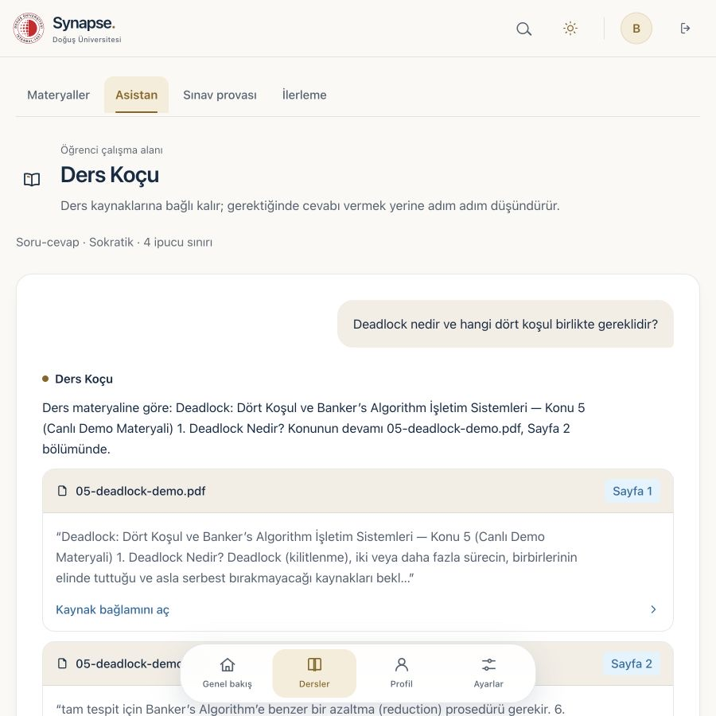
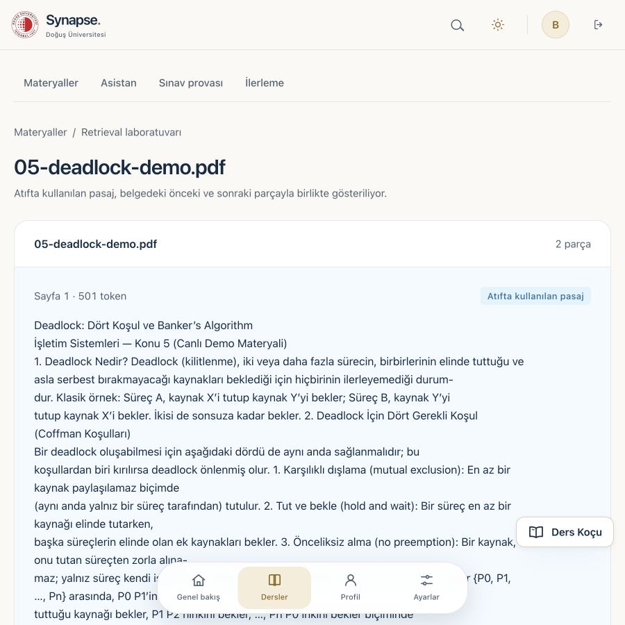

## Microsoft AI Engineering Internship

### [İstanbul Nabız](https://github.com/muratcan-ates/istanbul-nabiz)

<a href="https://github.com/muratcan-ates/istanbul-nabiz">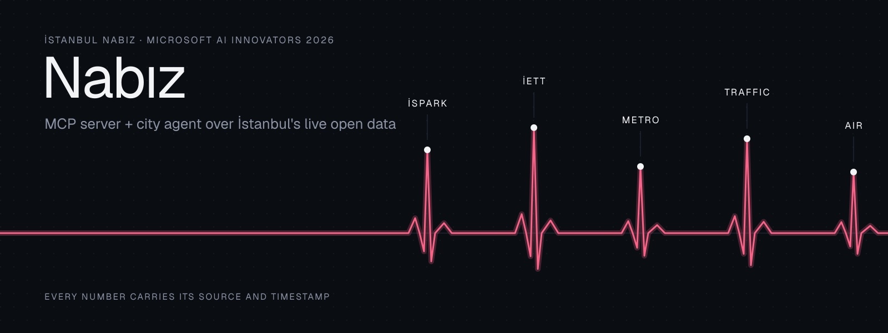</a>

**Microsoft AI Engineering Internship, AI Innovators program** · Solo project · September 2026

İstanbul Nabız is an unofficial MCP server over İstanbul's live open data. Its fifteen tools cover İSPARK car parks, İETT bus positions and timetables, Metro İstanbul service status and station accessibility, the traffic index and air quality. Every result carries its source URL and fetch time. The tests start the server as a subprocess, perform the MCP handshake, check that every tool is listed with a usable schema and call several of them end to end over stdio, the way a client would.

While building it I found that the municipality's GTFS `stop_times.csv` was cut off at Excel's row limit (1,048,575 rows plus a header) and had no rows at all for line 500T. Switching to the full export placed all 31 live 500T buses on their route. Measured against 1,351 observed arrivals, the bus arrival estimate the tools serve is off by about 13 minutes on average. A per-line calibration looked better on the data it was fitted to but did worse on later arrivals (35.8 against 10.2 minutes), so the tools keep the untuned rate. Both results are still too high, and the repository publishes them. The Azure infrastructure is written in Bicep and compiles in CI but is not deployed yet. This is an independent student project, not an official İBB service.

[Use it from an MCP client](https://github.com/muratcan-ates/istanbul-nabiz/blob/main/docs/mcp-usage.md) / [ETA accuracy report](https://github.com/muratcan-ates/istanbul-nabiz/blob/main/eval/results/eta.md) / [Architecture](https://github.com/muratcan-ates/istanbul-nabiz/blob/main/docs/architecture.svg)

Screens: offline demo on recorded İBB data

 
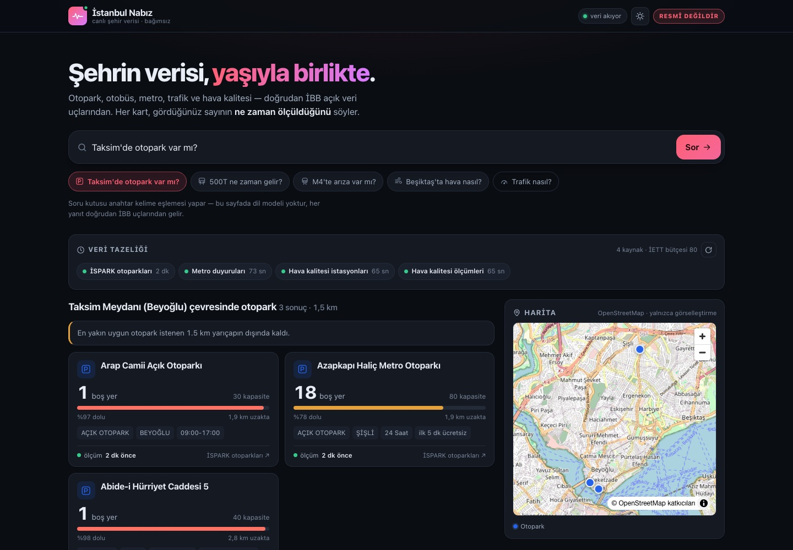
  
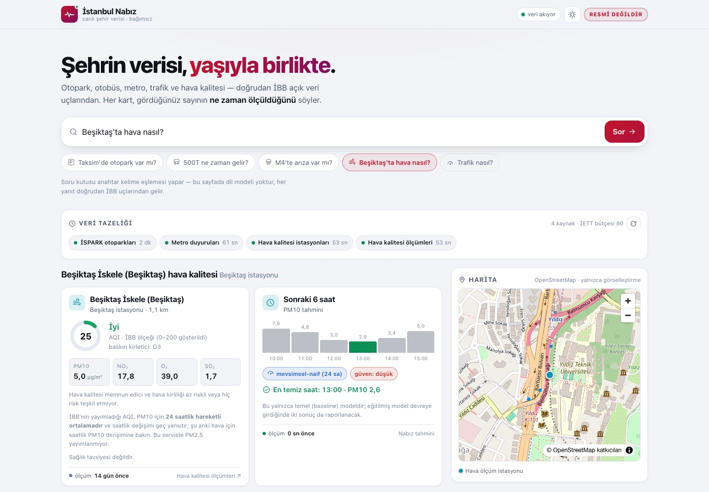

## More projects

### Applied AI and full-stack

**[OtoHesap](https://github.com/muratcan-ates/Oto-Hesap)**: a finance and stock dashboard for small businesses, built by a team of four for Medeniyet Teknopark's TeknoKampüs Arena (September 2026). I set up the architecture, repository, spec and CI and built the API core and the text-to-SQL assistant with AI coding agents; teammates owned the web UI, the procurement agent with its Telegram bot, and the data work. A Turkish question becomes SQL, which is checked against a sqlglot allow-list and run in a read-only transaction with a five-second timeout. A rule-based restocking agent (no LLM) sends a supplier order over Telegram only after a person approves it. 185 API tests pass in CI.

**[innova](https://github.com/muratcan-ates/innova)**: my individual diploma project for EPAM's AI-Native Engineering bootcamp (May 2026), an idea submission and evaluation portal with submitter and evaluator roles and an append-only evaluation history. I made the architecture decisions and reviewed the work, and Claude Code wrote the code. A constitution and a spec became 58 tasks, which it implemented in one overnight session. The stack is Next.js 15, Auth.js v5 and Prisma.

### Data and machine learning

**[telco-churn](https://github.com/muratcan-ates/telco-churn)**: a churn prediction service from a three-person team in the YZTA 5.0 data science challenge (April 2026). I wrote the scikit-learn pipeline and an MLflow script comparing three models. I also built a FastAPI `/predict` endpoint that returns the churn probability with its five strongest SHAP factors. The logistic regression, chosen over random forest and gradient boosting on a stratified 20% test split, scores ROC-AUC 0.842 on that split.

**[yzta-datathon-grup-27](https://github.com/muratcan-ates/yzta-datathon-grup-27)**: our five-person team's entry in the YZTA datathon (May 2026). I set up the team repository and merged my teammates' feature-engineering pull requests.

### Research and community

**[NanoSpace Knowledge Hub](https://nanospacekh.erbaharlab.com)**: an open-access database of cosmic carbon nanostructures built by the Erbahar Research Lab for the EU-funded COST Action CA21126. I joined at the NanoSpace DSG Hackathon (July 2025, Istanbul) in the front-end breakout group, which drafted designs for the homepage and the molecule record page ([meeting report](https://research.iac.es/proyecto/nanospace/media/Working_Group_meetings/report_DSG_meeting_final.pdf)). Later I implemented the first SvelteKit version of the homepage design (hero, search bar, features, latest-compounds and quick-tools sections), which the lab's lead developer has since extended. The code is private to the lab.

**[Hypnose](https://alierenkayhan.itch.io/hypnose)**: in Google's Game and Application Academy (2022 to 2023) I was Scrum Master of Team Zeniths. Over three documented sprints we built a first-person mystery game in Unity HDRP, and I built the level map and much of the game. We shared most of the work through Google Drive, so my part is not in the [repository](https://github.com/muratcan-ates/U-16-OUA-BOOTCAMP)'s commit history; the itch.io page credits me as muratcanatess.

**[GDG on Campus Doğuş website](https://github.com/gdg-dogus/gdg-dou-website)**: I'm credited in the repository as a member of the 2025–2026 web development team, and my [blog page commit](https://github.com/gdg-dogus/gdg-dou-website/commit/54d7012) became the base of the site's blog.

## Experience and programs

- **Data Engineering Intern, EPAM Systems** (Jul to Aug 2026): built a PostgreSQL data warehouse integrating two sales sources, with SQL ETL and a Power BI report.
- **AI Engineering Intern, Microsoft Türkiye** (Jun to Jul 2026): AI Innovators program; İstanbul Nabız, above, is my program project.
- **Volunteer Software Developer, NanoSpace** (Jul 2025 to Sep 2026): SvelteKit front-end work for a research database within the EU-funded COST Action CA21126.
- **IT and Network Infrastructure Intern** (Aug to Sep 2025): built an attendance-tracking app in C# WinForms and SQLite.
- **TEI Aviation Engines School** (Havacılık Motorları Okulu, Jan to May 2026): 16-week program on gas turbines, engine controls, power systems, manufacturing and testing, completed with a certificate of achievement.
- Google AI and Technology Academy, Data Science Fellow (2025 to 2026) · Huawei Cloud AI Bootcamp (2025) · Microsoft Learn Student Ambassador · GDG on Campus Doğuş core team, web development

## Toolchain

<picture>
  <source media="(max-width: 640px)" srcset="./assets/toolchain-mobile.svg" />
  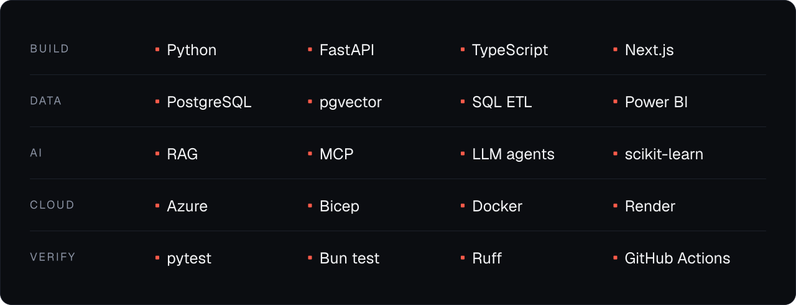
</picture>

## Contact

For internships, projects or a conversation about AI and cloud systems, reach me on [LinkedIn](https://linkedin.com/in/muratcanates).

Profile artwork is generated by the scripts in [`.github/scripts`](.github/scripts). Text is set in [Geist](https://github.com/vercel/geist-font) under the SIL Open Font License. The CloudSentinel and DOU-Synapse banners use those projects' own brand art.
