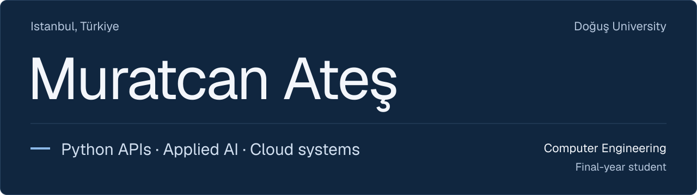
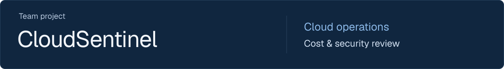
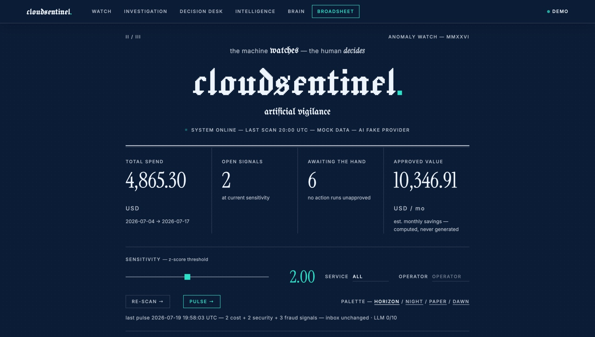
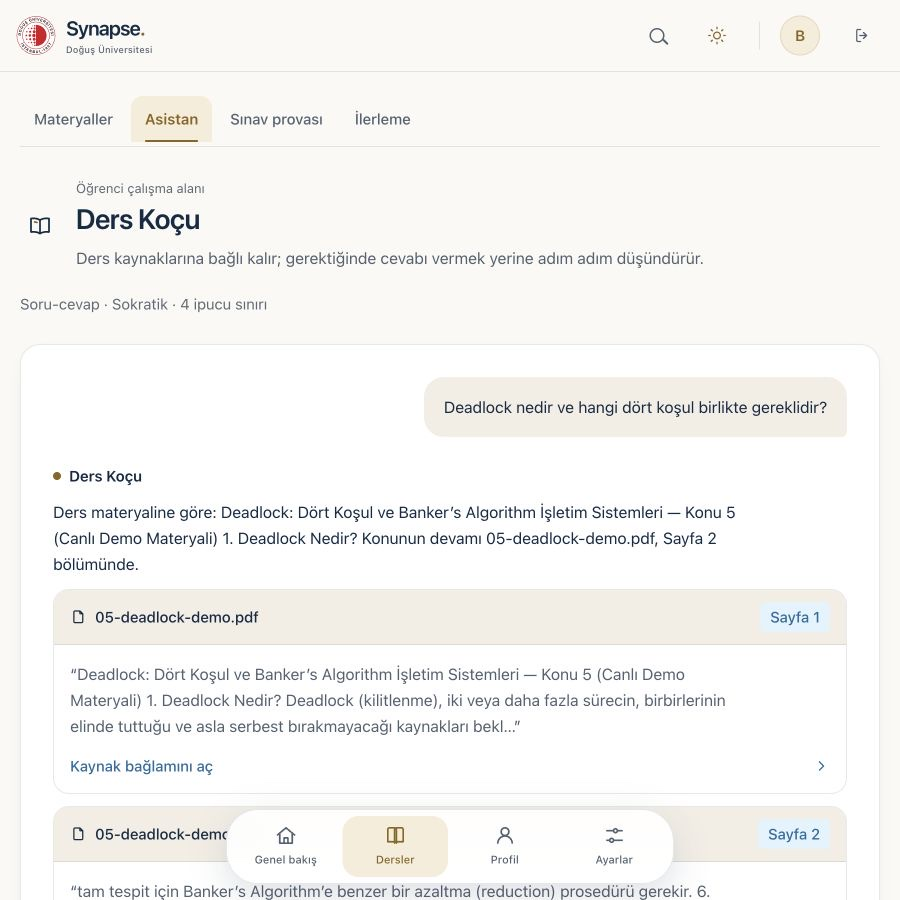
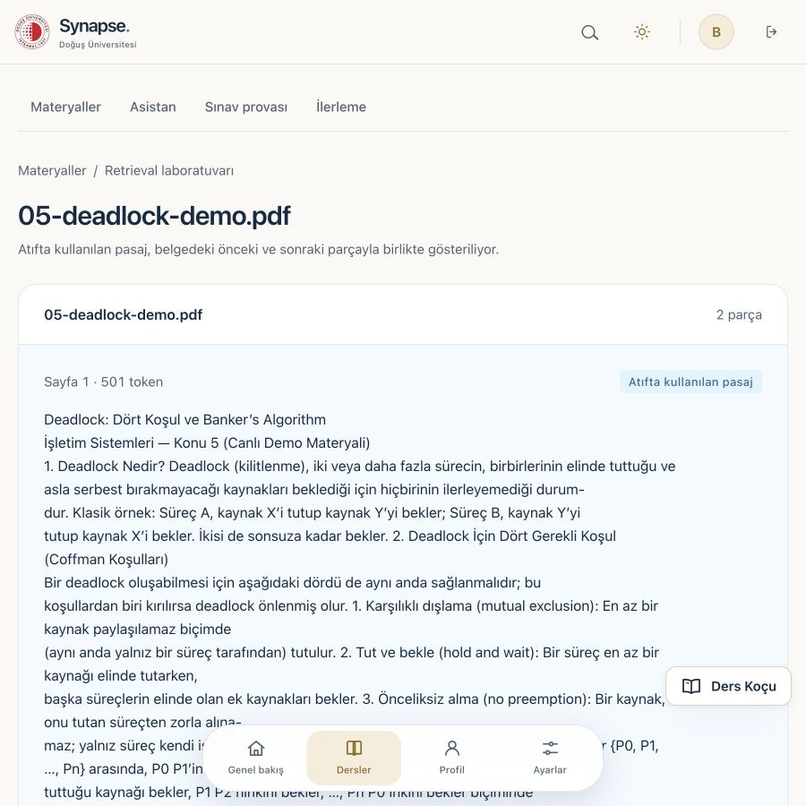
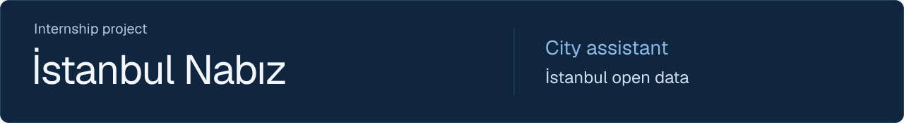
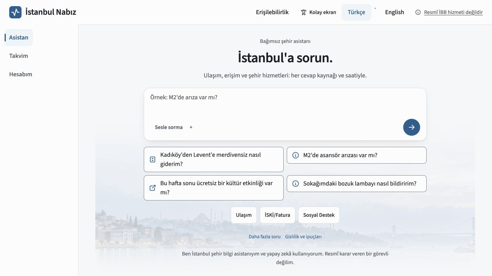
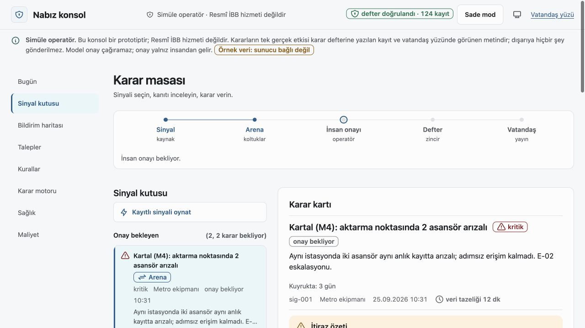
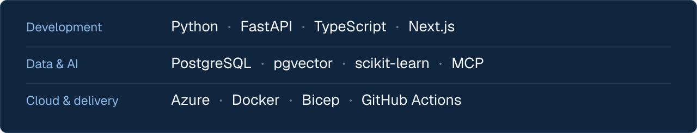
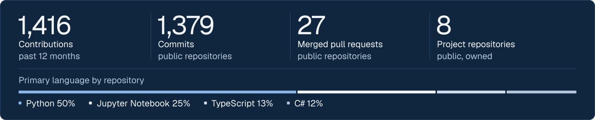

<picture>
  <source media="(max-width: 640px)" srcset="./assets/hero-mobile.svg" />
  
</picture>

I'm a final-year Computer Engineering student at Doğuş University in Istanbul. I work on Python APIs, retrieval-augmented assistants and MCP tools. I use AI coding agents for implementation, with written specs, code review, tests and CI checks.

[LinkedIn](https://linkedin.com/in/muratcanates) · [Medium](https://medium.com/@muratcanates) · [g.dev](https://g.dev/muratcanates) · [Repositories](https://github.com/muratcan-ates?tab=repositories)

## Selected projects

### [CloudSentinel](https://github.com/muratcan-ates/cloudsentinel)

<a href="https://github.com/muratcan-ates/cloudsentinel">
<picture>
  <source media="(max-width: 640px)" srcset="./assets/cloudsentinel-banner-mobile.svg" />
  
</picture>
</a>

**YZTA Bootcamp 2026 · Scrum Master · team of four · June–August 2026**

Cloud cost and security anomaly review. A statistical detector flags signals; agents explain the evidence and propose responses for human approval. Decisions are recorded in a hash-chained audit ledger. I built the LLM provider layer, analyst and recommender agents, approval lifecycle, ledger and deployment.

The public demo uses simulated data and a deterministic model stand-in. Approved actions are simulated.

[Demo](https://cloudsentinel-y5zh.onrender.com) · [API](https://cloudsentinel-y5zh.onrender.com/docs) · [Architecture](https://github.com/muratcan-ates/cloudsentinel/blob/main/docs/architecture.md) · [Evaluation](https://github.com/muratcan-ates/cloudsentinel/blob/main/docs/EVAL_SCORECARD.md) · [Limitations](https://github.com/muratcan-ates/cloudsentinel/blob/main/docs/LIMITATIONS.md)

Operator dashboard

 

### [DOU-Synapse](https://github.com/muratcan-ates/DOU-Synapse)

<a href="https://github.com/muratcan-ates/DOU-Synapse">
<picture>
  <source media="(max-width: 640px)" srcset="./assets/dou-synapse-banner-mobile.svg" />
  
</picture>
</a>

**Graduation project, Doğuş University · project lead · team of three · August–September 2026**

A course and exam assistant that answers from instructor-uploaded material, citing the file and page. Socratic mode gives hints before an explanation. I led the project and implemented the Next.js frontend and FastAPI backend. Retrieval combines PostgreSQL full-text search and pgvector; API membership checks and row-level security enforce course isolation.

The assistant refuses when retrieved evidence falls below its threshold. That threshold is still being tuned.

[Architecture (TR)](https://github.com/muratcan-ates/DOU-Synapse/blob/main/ARCHITECTURE.md) · [Isolation checks](https://github.com/muratcan-ates/DOU-Synapse/blob/main/supabase/tests/rls_isolation.sql) · [Test report (TR)](https://github.com/muratcan-ates/DOU-Synapse/blob/main/docs/test-report.md)

Cited answer and source context — offline demo

 

  

### [İstanbul Nabız](https://github.com/muratcan-ates/istanbul-nabiz)

<a href="https://github.com/muratcan-ates/istanbul-nabiz">
<picture>
  <source media="(max-width: 640px)" srcset="./assets/istanbul-nabiz-banner-mobile.svg" />
  
</picture>
</a>

**Microsoft AI Innovators program · solo project · September 2026**

An independent city assistant using İBB open data, with Turkish and English screens, accessible journey checks and spoken answers. Its 18 MCP tools share a rate-limited client and a historical data collector. Answers include their source and observation time; a simulated operator console supports evidence review and human approval.

The app runs locally. Azure infrastructure is written but undeployed, and the optional LLM path has not been evaluated with a real model. This is a student project, not an official İBB service. The bus arrival estimator's accuracy and limitations are documented below.

[Development branch](https://github.com/muratcan-ates/istanbul-nabiz/tree/gun2/entegrasyon) · [MCP guide](https://github.com/muratcan-ates/istanbul-nabiz/blob/main/docs/mcp-usage.md) · [Arrival estimates](https://github.com/muratcan-ates/istanbul-nabiz/blob/main/eval/results/eta.md) · [Architecture](https://github.com/muratcan-ates/istanbul-nabiz/blob/main/docs/architecture.svg)

Local citizen app and simulated operator console

 

  

## Other work

- **[OtoHesap](https://github.com/muratcan-ates/Oto-Hesap)** — small-business finance dashboard, team of four. I built the API core and read-only text-to-SQL assistant, and set up architecture and CI.
- **[innova](https://github.com/muratcan-ates/innova)** — EPAM bootcamp idea-evaluation portal. I defined the architecture and reviewed the implementation produced by Claude Code.
- **[telco-churn](https://github.com/muratcan-ates/telco-churn)** — scikit-learn churn pipeline and FastAPI prediction endpoint with SHAP explanations, built in a three-person team.
- **[YZTA datathon](https://github.com/muratcan-ates/yzta-datathon-grup-27)** — repository setup and feature-engineering integration for a five-person team.
- **[NanoSpace Knowledge Hub](https://nanospacekh.erbaharlab.com)** — homepage design and initial SvelteKit implementation for the Erbahar Research Lab's cosmic carbon database. [Hackathon report](https://research.iac.es/proyecto/nanospace/media/Working_Group_meetings/report_DSG_meeting_final.pdf).
- **[Hypnose](https://alierenkayhan.itch.io/hypnose)** — Unity HDRP mystery game; Scrum Master and level development with Team Zeniths.
- **[GDG on Campus Doğuş](https://github.com/gdg-dogus/gdg-dou-website)** — web development team; my [blog page](https://github.com/gdg-dogus/gdg-dou-website/commit/54d7012) became the site's blog base.

## Experience

- **EPAM Systems · Data Engineering Intern** — July–August 2026. PostgreSQL warehouse, SQL ETL and Power BI.
- **Microsoft Türkiye · AI Engineering Intern** — June–July 2026. AI Innovators program.
- **NanoSpace · Volunteer Software Developer** — July 2025–September 2026. Research database frontend.
- **IT and Network Infrastructure Intern** — August–September 2025. Attendance app in C# and SQLite.

Programs and community

TEI Aviation Engines School (January–May 2026); Google AI and Technology Academy, Data Science Fellow (2025–2026); Huawei Cloud AI Bootcamp (2025); Microsoft Learn Student Ambassador; GDG on Campus Doğuş core team, web development.

## Technologies

<picture>
  <source media="(max-width: 640px)" srcset="./assets/toolchain-mobile.svg" />
  
</picture>

## GitHub activity

<picture>
  <source media="(max-width: 640px)" srcset="./assets/metrics-mobile.svg" />
  
</picture>

Updated weekly. Contributions follow the profile calendar; commits and merged pull requests cover public repositories. Project and language totals exclude forks, archived and empty repositories and this profile repository. Language shares count repositories, not lines of code.

## Contact

For internships or project enquiries, reach me on [LinkedIn](https://linkedin.com/in/muratcanates).
